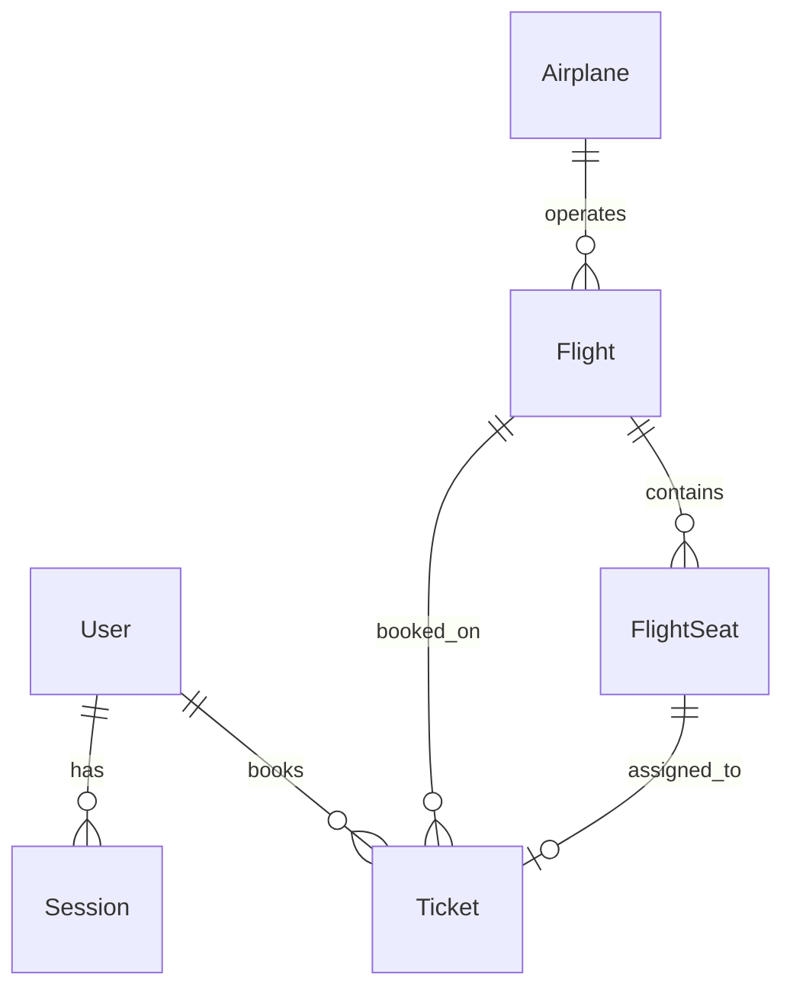

# 1. Architecture Fundamentals

> **Priority:** 🔴 **CRITICAL** — Read this first before any implementation work.

---

## Project Overview

**FlyHigher** is a Next.js 14 flight booking application with:

- App Router architecture
- Prisma ORM with PostgreSQL (Supabase)
- Lucia Auth for authentication
- TanStack Query for server state
- Tailwind CSS for styling

---

## Directory Structure

```
booking-ticket/
├── prisma/
│   └── schema.prisma          # Database schema
├── src/
│   ├── app/
│   │   ├── (auth)/            # Auth pages (login, register)
│   │   ├── (home)/            # Customer-facing pages
│   │   │   ├── page.tsx       # Landing/Homepage
│   │   │   ├── available-flights/
│   │   │   ├── choose-seat/[id]/
│   │   │   ├── checkout/
│   │   │   ├── my-tickets/
│   │   │   ├── success-checkout/
│   │   │   └── about/
│   │   ├── dashboard/(home)/  # Admin dashboard
│   │   │   ├── airplanes/
│   │   │   ├── flights/
│   │   │   ├── tickets/
│   │   │   └── users/
│   │   ├── api/               # API routes
│   │   └── _components/       # Shared page components
│   ├── components/ui/         # Reusable UI components
│   ├── hooks/                 # Custom React hooks
│   ├── lib/                   # Utilities (auth, supabase, utils)
│   └── types/                 # TypeScript definitions
├── context/                   # Documentation (YOU ARE HERE)
└── stitch_flight_search_landing_page/  # Reference designs
```

---

## Route Architecture

### Customer Routes `(home)`

| Route                     | Purpose                     | Reference Design             |
| ------------------------- | --------------------------- | ---------------------------- |
| `/`                       | Landing page with search    | `flight_search_landing_page` |
| `/available-flights`      | Flight results with filters | `flight_results_page`        |
| `/choose-seat/[id]`       | Seat selection              | `flight_seat_selection`      |
| `/checkout`               | Payment page                | `seat_selection_payment`     |
| `/success-checkout`       | Booking confirmation        | `booking_confirmation_1/2`   |
| `/my-tickets`             | User's tickets list         | —                            |
| `/my-tickets/detail/[id]` | Ticket management           | `manage_booking_details`     |
| `/about`                  | Company info                | `about_us__our_story_1/2/3`  |

### Admin Routes `dashboard/(home)`

| Route                  | Purpose          | Reference Design               |
| ---------------------- | ---------------- | ------------------------------ |
| `/dashboard`           | Overview stats   | `admin_dashboard_overview_1/2` |
| `/dashboard/flights`   | Manage flights   | `admin__flights_overview`      |
| `/dashboard/airplanes` | Manage airplanes | —                              |
| `/dashboard/tickets`   | View bookings    | `admin__manage_bookings`       |
| `/dashboard/users`     | User management  | `admin__users_management`      |

---

## Database Schema

### Core Models

```prisma
User       → id, name, email, password, passport, role (CUSTOMER/ADMIN)
Session    → id, userId, expiresAt
Airplane   → id, code, name, image
Flight     → id, planeId, departureDate, departureCity, destinationCity, price, etc.
FlightSeat → id, flightId, seatNumber, isBooked, type (ECONOMY/BUSINESS/FIRST)
Ticket     → id, code, flightId, customerId, seatId, bookingDate, price, status
```

### Relationships



---

## Authentication Flow

Using **Lucia Auth v3** with Prisma adapter:

```typescript
// src/lib/auth.ts
export const lucia = new Lucia(adapter, {
  sessionCookie: { ... },
  getUserAttributes: (attributes) => ({ ... })
});
```

### Auth Patterns

1. **Server Components** → Use `validateRequest()` from `lib/auth.ts`
2. **API Routes** → Use `lucia.createSession()`, `lucia.validateSession()`
3. **Client Components** → Fetch session via API or pass as prop

---

## State Management Strategy

### Server State (TanStack Query)

```typescript
// For data fetching and caching
import { useQuery, useMutation } from "@tanstack/react-query";
```

**Use Cases:**

- Flight search results
- Ticket listings
- User data

### Client State (React Context)

```typescript
// src/app/(home)/choose-seat/[id]/providers/SeatProvider.tsx
const SeatContext = createContext<SeatContextType>({...});
```

**Use Cases:**

- Seat selection state
- Checkout data
- UI state (modals, filters)

---

## Naming Conventions

| Type       | Convention                     | Example                       |
| ---------- | ------------------------------ | ----------------------------- |
| Components | PascalCase                     | `FlightSearchWidget.tsx`      |
| Pages      | lowercase folder + `page.tsx`  | `choose-seat/[id]/page.tsx`   |
| Hooks      | camelCase with `use` prefix    | `useCheckoutData.tsx`         |
| Utils      | camelCase                      | `formatPrice()`               |
| API Routes | lowercase + `route.ts`         | `api/flights/route.ts`        |
| Types      | PascalCase + Type/Props suffix | `FlightType`, `SeatItemProps` |

---

## File Organization Rules

### Page-Specific Components

```
page-folder/
├── page.tsx              # Main page
├── loading.tsx           # Loading skeleton
├── error.tsx             # Error boundary
├── _components/          # Page-specific components
│   ├── ComponentA.tsx
│   └── ComponentB.tsx
└── providers/            # Context providers
    └── SomeProvider.tsx
```

### Shared Components

```
src/components/
└── ui/                   # Reusable across pages
    ├── button.tsx        # Based on shadcn/ui
    ├── input.tsx
    └── ...
```

---

## Next Steps

After reading this document:

1. Read [2-design-system.md](file:///c:/Projects/booking-ticket/context/2-design-system.md) for component patterns
2. Read [3-data-layer.md](file:///c:/Projects/booking-ticket/context/3-data-layer.md) for API and state
3. Follow [4-implementation-roadmap.md](file:///c:/Projects/booking-ticket/context/4-implementation-roadmap.md) for tasks

---

_Last updated: December 21, 2025_
