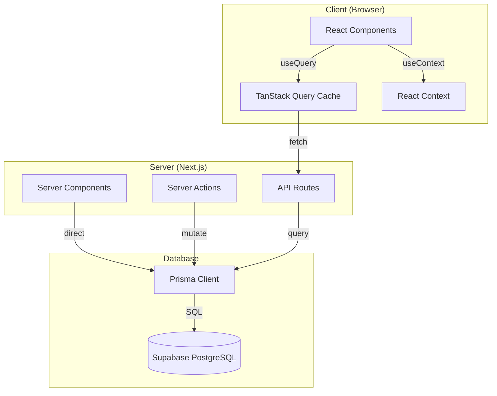

# 3. Data Layer & State Management

> **Priority:** 🔴 **HIGH** — Critical for performance, caching, and error handling.

---

## Data Flow Architecture



---

## API Layer

### Current API Routes

| Route              | Method | Purpose                     |
| ------------------ | ------ | --------------------------- |
| `/api/flight`      | GET    | Search flights with filters |
| `/api/transaction` | POST   | Create booking/payment      |
| `/api/transaction` | GET    | Get user transactions       |

### Recommended API Structure

```
src/app/api/
├── flights/
│   ├── route.ts           # GET - List/search flights
│   └── [id]/
│       └── route.ts       # GET - Single flight details
├── seats/
│   └── [flightId]/
│       └── route.ts       # GET - Seats for a flight
├── bookings/
│   ├── route.ts           # GET - User bookings, POST - Create
│   └── [id]/
│       └── route.ts       # GET, PATCH, DELETE - Single booking
├── auth/
│   ├── login/route.ts
│   ├── register/route.ts
│   └── logout/route.ts
└── admin/
    ├── stats/route.ts     # Dashboard statistics
    ├── flights/route.ts   # CRUD flights
    └── users/route.ts     # CRUD users
```

### API Response Format

```typescript
// Success response
interface ApiResponse<T> {
  success: true;
  data: T;
  meta?: {
    total: number;
    page: number;
    pageSize: number;
  };
}

// Error response
interface ApiError {
  success: false;
  error: {
    code: string;
    message: string;
    details?: Record<string, string[]>;
  };
}
```

---

## TanStack Query Setup

### Query Client Configuration

```typescript
// src/lib/query-client.ts
import { QueryClient } from "@tanstack/react-query";

export const queryClient = new QueryClient({
  defaultOptions: {
    queries: {
      staleTime: 1000 * 60 * 5, // 5 minutes
      gcTime: 1000 * 60 * 30, // 30 minutes (formerly cacheTime)
      retry: 2,
      refetchOnWindowFocus: false,
    },
    mutations: {
      retry: 0,
    },
  },
});
```

### Query Keys Convention

```typescript
// src/lib/query-keys.ts
export const queryKeys = {
  // Flights
  flights: {
    all: ["flights"] as const,
    search: (params: FlightSearchParams) =>
      ["flights", "search", params] as const,
    detail: (id: string) => ["flights", id] as const,
  },

  // Seats
  seats: {
    byFlight: (flightId: string) => ["seats", flightId] as const,
    byClass: (flightId: string, classType: string) =>
      ["seats", flightId, classType] as const,
  },

  // Bookings
  bookings: {
    all: ["bookings"] as const,
    mine: (userId: string) => ["bookings", "user", userId] as const,
    detail: (id: string) => ["bookings", id] as const,
  },

  // User
  user: {
    current: ["user", "current"] as const,
    profile: (id: string) => ["user", id] as const,
  },
};
```

### Query Hooks Pattern

```typescript
// src/hooks/useFlights.ts
import { useQuery } from "@tanstack/react-query";
import { queryKeys } from "@/lib/query-keys";

export function useFlights(params: FlightSearchParams) {
  return useQuery({
    queryKey: queryKeys.flights.search(params),
    queryFn: async () => {
      const searchParams = new URLSearchParams(
        params as Record<string, string>
      );
      const res = await fetch(`/api/flights?${searchParams}`);
      if (!res.ok) throw new Error("Failed to fetch flights");
      return res.json();
    },
    enabled: Boolean(params.from && params.to && params.date),
  });
}

export function useFlight(id: string) {
  return useQuery({
    queryKey: queryKeys.flights.detail(id),
    queryFn: async () => {
      const res = await fetch(`/api/flights/${id}`);
      if (!res.ok) throw new Error("Flight not found");
      return res.json();
    },
    enabled: Boolean(id),
  });
}
```

---

## State Management

### Server State (TanStack Query)

Use for data that lives on the server:

| Data                  | Cache Time | Stale Time |
| --------------------- | ---------- | ---------- |
| Flight search results | 30 min     | 5 min      |
| Flight details        | 1 hour     | 15 min     |
| Seat availability     | 1 min      | 30 sec     |
| User bookings         | 10 min     | 2 min      |

### Client State (React Context)

Use for ephemeral UI state:

```typescript
// Seat selection context
interface SeatContextType {
  selectedSeat: FlightSeat | null;
  selectedClass: TypeSeat;
  setSelectedSeat: (seat: FlightSeat | null) => void;
  setSelectedClass: (type: TypeSeat) => void;
}

// Checkout context
interface CheckoutContextType {
  flight: Flight | null;
  seat: FlightSeat | null;
  passenger: PassengerInfo | null;
  setPassenger: (info: PassengerInfo) => void;
}

// Filter context (for flight results)
interface FilterContextType {
  classFilter: TypeSeat[];
  stops: number[];
  airlines: string[];
  priceRange: [number, number];
  sortBy: "price" | "duration" | "value";
  setFilters: (filters: Partial<FilterState>) => void;
  resetFilters: () => void;
}
```

### URL State (Search Params)

Use for shareable/bookmarkable state:

```typescript
// Flight search
/available-flights?from=JKT&to=DPS&date=2025-01-15&class=ECONOMY

// Flight results with filters
/available-flights?from=JKT&to=DPS&date=2025-01-15&stops=0,1&sort=price
```

---

## Caching Strategy

### Cache Layers

```
┌─────────────────────────────────────┐
│  Browser Cache (HTTP caching)       │ ← Static assets, images
├─────────────────────────────────────┤
│  TanStack Query Cache               │ ← API responses
├─────────────────────────────────────┤
│  Next.js Cache (fetch cache)        │ ← Server-side data
├─────────────────────────────────────┤
│  Database Indexes                   │ ← Query optimization
└─────────────────────────────────────┘
```

### Cache Invalidation

```typescript
// After successful booking
import { useQueryClient } from "@tanstack/react-query";

const queryClient = useQueryClient();

// Invalidate seat availability for the flight
queryClient.invalidateQueries({ queryKey: queryKeys.seats.byFlight(flightId) });

// Invalidate user's bookings
queryClient.invalidateQueries({ queryKey: queryKeys.bookings.mine(userId) });
```

---

## Error Handling

### Error Types

```typescript
// src/types/errors.ts
export class ApiError extends Error {
  constructor(
    public code: string,
    public message: string,
    public statusCode: number = 500,
    public details?: Record<string, string[]>
  ) {
    super(message);
    this.name = "ApiError";
  }
}

export const ErrorCodes = {
  // Auth errors
  UNAUTHORIZED: "UNAUTHORIZED",
  FORBIDDEN: "FORBIDDEN",

  // Validation errors
  VALIDATION_ERROR: "VALIDATION_ERROR",
  INVALID_INPUT: "INVALID_INPUT",

  // Business errors
  SEAT_UNAVAILABLE: "SEAT_UNAVAILABLE",
  FLIGHT_FULL: "FLIGHT_FULL",
  BOOKING_EXPIRED: "BOOKING_EXPIRED",

  // Payment errors
  PAYMENT_FAILED: "PAYMENT_FAILED",
  INSUFFICIENT_FUNDS: "INSUFFICIENT_FUNDS",

  // Generic
  NOT_FOUND: "NOT_FOUND",
  SERVER_ERROR: "SERVER_ERROR",
} as const;
```

### Error Boundaries

```typescript
// src/app/(home)/error.tsx
"use client";

export default function Error({
  error,
  reset,
}: {
  error: Error & { digest?: string };
  reset: () => void;
}) {
  return (
    <div className="min-h-[50vh] flex flex-col items-center justify-center">
      <h2 className="text-2xl font-bold text-text-dark mb-4">
        Something went wrong
      </h2>
      <p className="text-gray-500 mb-6">{error.message}</p>
      <button
        onClick={() => reset()}
        className="bg-sky-primary text-white px-6 py-3 rounded-full font-semibold"
      >
        Try again
      </button>
    </div>
  );
}
```

### Error Display Components

```typescript
// Inline error
<div className="bg-red-50 border border-red-200 rounded-xl p-4 flex items-center gap-3">
  <AlertCircle className="h-5 w-5 text-red-500" />
  <p className="text-red-600 text-sm">{error.message}</p>
</div>;

// Toast error (using existing toast hook)
toast({
  variant: "destructive",
  title: "Booking Failed",
  description: error.message,
});
```

---

## Loading States

### Loading Patterns

```typescript
// Skeleton components per page
// src/app/(home)/available-flights/loading.tsx
export default function Loading() {
  return (
    <div className="space-y-4">
      {[...Array(5)].map((_, i) => (
        <div key={i} className="bg-white rounded-2xl p-6 animate-pulse">
          <div className="h-4 bg-gray-200 rounded w-1/4 mb-4" />
          <div className="h-8 bg-gray-200 rounded w-3/4" />
        </div>
      ))}
    </div>
  );
}
```

### Loading State in Queries

```typescript
export function FlightResults() {
  const { data, isLoading, isError, error } = useFlights(params);

  if (isLoading) return <FlightsSkeleton />;
  if (isError) return <ErrorDisplay error={error} />;
  if (!data?.length) return <EmptyState message="No flights found" />;

  return <FlightList flights={data} />;
}
```

---

## Form Validation (Zod)

### Schema Definitions

```typescript
// src/lib/validations/booking.ts
import { z } from "zod";

export const passengerSchema = z.object({
  name: z.string().min(2, "Name must be at least 2 characters"),
  email: z.string().email("Invalid email address"),
  passport: z
    .string()
    .regex(/^[A-Z0-9]{6,9}$/, "Invalid passport number")
    .optional(),
  phone: z
    .string()
    .regex(/^\+?[0-9]{10,15}$/, "Invalid phone number")
    .optional(),
});

export const paymentSchema = z.object({
  method: z.enum(["card", "ewallet", "qris"]),
  cardNumber: z
    .string()
    .regex(/^[0-9]{16}$/, "Invalid card number")
    .optional(),
  cardName: z.string().min(2).optional(),
  expiry: z
    .string()
    .regex(/^(0[1-9]|1[0-2])\/[0-9]{2}$/, "Invalid expiry (MM/YY)")
    .optional(),
  cvc: z
    .string()
    .regex(/^[0-9]{3,4}$/, "Invalid CVC")
    .optional(),
});

export type PassengerInput = z.infer<typeof passengerSchema>;
export type PaymentInput = z.infer<typeof paymentSchema>;
```

### Form Handling

```typescript
// Pattern: Controlled form with Zod validation
const [formData, setFormData] = useState<PassengerInput>({
  name: "",
  email: "",
});
const [errors, setErrors] = useState<Record<string, string>>({});

const handleSubmit = () => {
  const result = passengerSchema.safeParse(formData);
  if (!result.success) {
    const fieldErrors: Record<string, string> = {};
    result.error.errors.forEach((err) => {
      if (err.path[0]) fieldErrors[err.path[0] as string] = err.message;
    });
    setErrors(fieldErrors);
    return;
  }
  // Proceed with valid data
  onSubmit(result.data);
};
```

---

## Optimistic Updates

### Pattern for Seat Selection

```typescript
// When user selects a seat, immediately update UI
// then sync with server

const selectSeat = useMutation({
  mutationFn: (seatId: string) => reserveSeat(seatId),
  onMutate: async (seatId) => {
    // Cancel outgoing refetches
    await queryClient.cancelQueries({
      queryKey: queryKeys.seats.byFlight(flightId),
    });

    // Snapshot previous value
    const previousSeats = queryClient.getQueryData(
      queryKeys.seats.byFlight(flightId)
    );

    // Optimistically update
    queryClient.setQueryData(
      queryKeys.seats.byFlight(flightId),
      (old: Seat[]) =>
        old.map((s) => (s.id === seatId ? { ...s, isBooked: true } : s))
    );

    return { previousSeats };
  },
  onError: (err, seatId, context) => {
    // Rollback on error
    queryClient.setQueryData(
      queryKeys.seats.byFlight(flightId),
      context?.previousSeats
    );
    toast({ variant: "destructive", title: "Failed to reserve seat" });
  },
});
```

---

## Next Steps

1. Create `src/lib/query-keys.ts`
2. Create `src/lib/validations/` folder with schemas
3. Create reusable query hooks in `src/hooks/`
4. Add error boundaries to route segments
5. Standardize API response format

Continue to [4-implementation-roadmap.md](file:///c:/Projects/booking-ticket/context/4-implementation-roadmap.md)

---

_Last updated: December 21, 2025_
