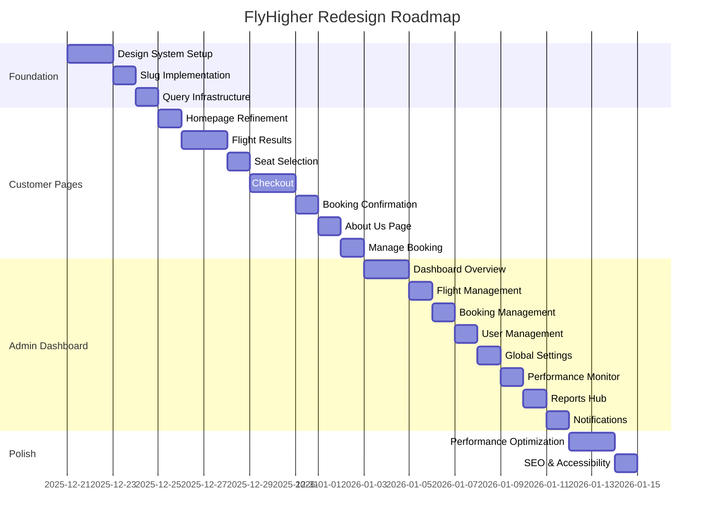

# 4. Implementation Roadmap

> **Priority:** 🔴 **ESSENTIAL** — Follow this step-by-step for systematic implementation.

---

## Phase Overview



---

## Phase 1: Foundation (Days 1-3)

### 1.1 Design System Setup ✅ COMPLETED

**Files Created/Updated:** _(Last updated: December 21, 2025)_

| Task                        | File                                | Status  |
| --------------------------- | ----------------------------------- | ------- |
| Add reusable Card component | `src/components/ui/card.tsx`        | ✅ Done |
| Add Tabs component          | `src/components/ui/tabs.tsx`        | ✅ Done |
| Add Breadcrumb component    | `src/components/ui/breadcrumb.tsx`  | ✅ Done |
| Enhance Skeleton component  | `src/components/ui/skeleton.tsx`    | ✅ Done |
| Add EmptyState component    | `src/components/ui/empty-state.tsx` | ✅ Done |
| Update button variants      | `src/components/ui/button.tsx`      | ✅ Done |
| Add design tokens           | `tailwind.config.ts`                | ✅ Done |

**New Button Variants Available:**

- `sky` — Primary blue CTA with shadow
- `skyOutline` — Blue outline button
- `danger` — Red danger action
- `subtle` — Gray subtle button
- Size `xl` — Extra large rounded button

**New Skeleton Exports:**

- `Skeleton` with variants: default, text, title, card, avatar, button
- `SkeletonCard` — Pre-composed card skeleton
- `SkeletonFlightCard` — Flight result card skeleton

> [!NOTE] > **Loading Strategy:** Use **skeleton loading** for page/section loading. **Inline micro-spinner** only for small scope operations (button submit, inline refresh).

**Verification:**

- [x] Components created and typed correctly
- [ ] Create a test page at `/dev/design-system` to preview all components
- [ ] Verify components render correctly on mobile and desktop

---

### 1.2 Slug Implementation 🟡 IN PROGRESS

**Goal:** Replace UUID-only URLs with human-readable slugs for better SEO.

**Database Changes:** _(Last updated: December 21, 2025)_

```prisma
// prisma/schema.prisma - UPDATED ✅

model Flight {
  id                  String       @id @default(cuid())
  slug                String?      @unique  // SEO-friendly: "jkt-dps-2025-01-15"
  // ... other fields
  @@index([departureCityCode, destinationCityCode, departureDate])
  @@index([departureDate])
}

model Ticket {
  id            String       @id @default(cuid())
  code          String       @unique
  slug          String?      @unique  // SEO-friendly: "booking-flyh-abc123"
  // ... other fields
  @@index([customerId])
  @@index([status])
  @@index([bookingDate])
}
```

**Slug Generation Functions:** _(Added to `src/lib/utils.ts`) ✅_

- `generateFlightSlug(flight)` — Creates "jkt-dps-2025-01-15" format
- `generateBookingSlug(ticketCode)` — Creates "booking-flyh-abc123" format
- `parseIdOrSlug(param)` — Determines if URL param is ID or slug

**Route Changes:**

| Current                   | New                   | Purpose               |
| ------------------------- | --------------------- | --------------------- |
| `/choose-seat/[id]`       | `/choose-seat/[slug]` | Flight seat selection |
| `/my-tickets/detail/[id]` | `/my-tickets/[slug]`  | Ticket details        |

**Implementation Steps:**

1. [x] Add `slug` field to Flight and Ticket models in Prisma schema
2. [ ] Create migration: `npx prisma migrate dev --name add_slugs`
3. [ ] Update seed script to generate slugs for existing data
4. [x] Create slug generation utility functions
5. [ ] Update API routes to support lookup by slug
6. [ ] Update page routes to use `[slug]` instead of `[id]`
7. [ ] Add redirects for old UUID URLs to new slug URLs

> [!NOTE]
> Migration requires database access. Run `npx prisma migrate dev --name add_slugs` when ready.

---

### 1.3 Query Infrastructure ✅ COMPLETED

**Files Created:** _(Last updated: December 21, 2025)_

| File                             | Purpose                           | Status  |
| -------------------------------- | --------------------------------- | ------- |
| `src/lib/query-keys.ts`          | Centralized query key definitions | ✅ Done |
| `src/lib/validations/index.ts`   | Zod schema exports                | ✅ Done |
| `src/lib/validations/booking.ts` | Booking-related schemas           | ✅ Done |
| `src/lib/validations/flight.ts`  | Flight search schemas             | ✅ Done |

**Query Keys Available:**

- `queryKeys.flights` — search, detail, bySlug
- `queryKeys.seats` — byFlight, byFlightAndClass
- `queryKeys.bookings` — list, mine, detail, byCode
- `queryKeys.user` — current, profile
- `queryKeys.admin` — stats, recentBookings, revenue

**Validation Schemas Available:**

- `passengerSchema`, `paymentSchema`, `createBookingSchema`
- `flightSearchSchema`, `flightFilterSchema`, `createFlightSchema`

---

## Phase 2: Customer Pages (Days 4-10)

### 2.1 Homepage Refinement

**Reference:** `stitch_flight_search_landing_page/flight_search_landing_page/`

**Tasks:**

| Task                            | Component             | Status  |
| ------------------------------- | --------------------- | ------- |
| Hero section with search widget | `page.tsx`            | ✅ Done |
| Popular destinations            | `DestinationCard.tsx` | ✅ Done |
| Floating 3D illustrations       | `page.tsx`            | ✅ Done |
| Light navbar                    | `NavbarLight.tsx`     | ✅ Done |
| SEO meta tags                   | `layout.tsx`          | ✅ Done |

**Remaining Work:**

- [x] Add proper SEO metadata (title, description, OpenGraph) — _Done in `layout.tsx`_
- [ ] Add structured data for flight search (JSON-LD)
- [ ] Optimize images with next/image
- [ ] Add loading states for destination cards

---

### 2.2 Flight Results Page

**Reference:** `stitch_flight_search_landing_page/flight_results_page/`

**Tasks:**

| Task                     | Component               | Status     |
| ------------------------ | ----------------------- | ---------- |
| Search header with route | `page.tsx`              | ✅ Done    |
| Filter sidebar           | `FilterClass.tsx`, etc. | ✅ Done    |
| Flight result cards      | `FlightItem.tsx`        | ✅ Done    |
| Sorting tabs             | `page.tsx`              | ✅ Done    |
| URL-based filters        | `page.tsx`              | 🟡 Partial |

**Remaining Work:**

- [ ] Persist filters in URL for shareability
- [ ] Add filter count badges
- [x] Add skeleton loading per card — _Created `loading.tsx`_
- [x] Add "No results" empty state — _Using `EmptyState` component_
- [ ] Add price range slider filter

---

### 2.3 Seat Selection Page

**Reference:** `stitch_flight_search_landing_page/flight_seat_selection/`

**Tasks:**

| Task               | Component              | Status  |
| ------------------ | ---------------------- | ------- |
| Fuselage seat map  | `SeatList.tsx`         | ✅ Done |
| Class toggle       | `SeatClassToggle.tsx`  | ✅ Done |
| Interactive legend | `SeatLegend.tsx`       | ✅ Done |
| Flight sidebar     | `FlightDetail.tsx`     | ✅ Done |
| Mobile bottom bar  | `MobileSummaryBar.tsx` | ✅ Done |

**Remaining Work:**

- [ ] Add seat reservation timeout (hold for 10 minutes)
- [ ] Show seat availability refresh indicator
- [ ] Add seat selection confirmation animation

---

### 2.4 Checkout Page ✅ SIMPLIFIED

**Reference:** `stitch_flight_search_landing_page/seat_selection_payment/`

**Design Decision:** Removed credit card form and payment method tabs since Midtrans Snap handles all payment UI. Cleaner UX with direct payment flow.

**Components:**

| Task                    | Component              | Status  |
| ----------------------- | ---------------------- | ------- |
| Booking summary sidebar | `BookingSummary.tsx`   | ✅ Done |
| Payment methods preview | `PaymentForm.tsx`      | ✅ Done |
| What's included section | `PaymentForm.tsx`      | ✅ Done |
| Mobile sticky bar       | `MobilePaymentBar.tsx` | ✅ Done |
| Breadcrumb navigation   | `page.tsx`             | ✅ Done |
| SEO metadata            | `page.tsx`             | ✅ Done |

**Payment Flow:**

1. User reviews booking summary
2. Clicks "Pay" button
3. Midtrans Snap popup opens
4. User selects payment method & completes in Midtrans

---

### 2.5 Booking Confirmation ✅ REDESIGNED

**Reference:** `stitch_flight_search_landing_page/booking_confirmation_1/` and `booking_confirmation_2/`

**Components:**

| Task                         | Status  |
| ---------------------------- | ------- |
| Light theme layout           | ✅ Done |
| Success animation (sparkles) | ✅ Done |
| Boarding pass preview card   | ✅ Done |
| Download ticket button       | ✅ Done |
| Share booking button         | ✅ Done |
| What's Next section          | ✅ Done |
| SEO metadata                 | ✅ Done |

---

### 2.6 About Us Page ✅ REDESIGNED

**Reference:** `stitch_flight_search_landing_page/about_us__our_story_1/`, `about_us__our_story_2/`, `about_us__our_story_3/`

**Components:**

| Task                      | Status  |
| ------------------------- | ------- |
| Light theme layout        | ✅ Done |
| Hero section with tagline | ✅ Done |
| Stats section (4 metrics) | ✅ Done |
| Mission section           | ✅ Done |
| Values cards (3 values)   | ✅ Done |
| Company timeline          | ✅ Done |
| CTA section               | ✅ Done |
| SEO metadata              | ✅ Done |

---

### 2.7 Manage Booking Page ✅ CORE DONE

**Reference:** `stitch_flight_search_landing_page/manage_booking_details/`

**Components:**

| Task                     | Component              | Status  |
| ------------------------ | ---------------------- | ------- |
| Light theme layout       | `page.tsx`             | ✅ Done |
| Flight timeline          | `detail/[id]/page.tsx` | ✅ Done |
| Management action cards  | `detail/[id]/page.tsx` | ✅ Done |
| Passenger sidebar        | `detail/[id]/page.tsx` | ✅ Done |
| Payment summary          | `detail/[id]/page.tsx` | ✅ Done |
| Cancellation danger zone | `detail/[id]/page.tsx` | ✅ Done |
| SEO metadata             | `page.tsx`             | ✅ Done |

**Future Enhancements:**

- [ ] Change dates modal
- [ ] Baggage add-on modal
- [ ] Class upgrade flow
- [ ] Cancellation confirmation modal

---

## Phase 3: Admin Dashboard (Days 11-15)

### 3.1 Dashboard Overview

**Reference:** `stitch_flight_search_landing_page/admin_dashboard_overview_1/` and `admin_dashboard_overview_2/`

**Tasks:**

| Task                                   | Status  |
| -------------------------------------- | ------- |
| Stats cards (Revenue, Bookings, Users) | 🔴 TODO |
| Revenue chart                          | 🔴 TODO |
| Recent bookings table                  | 🔴 TODO |
| Quick actions                          | 🔴 TODO |

---

### 3.2 Flight Management

**Reference:** `stitch_flight_search_landing_page/admin__flights_overview/`

**Tasks:**

| Task                | Status     |
| ------------------- | ---------- |
| Flights data table  | ✅ Done    |
| Add flight form     | ✅ Done    |
| Edit flight modal   | 🟡 Partial |
| Delete confirmation | 🟡 Basic   |

---

### 3.3 Booking Management

**Reference:** `stitch_flight_search_landing_page/admin__manage_bookings/`

**Tasks:**

| Task                  | Status   |
| --------------------- | -------- |
| Bookings data table   | ✅ Done  |
| Booking status badges | 🟡 Basic |
| View booking details  | 🔴 TODO  |
| Manual status update  | 🔴 TODO  |

---

### 3.4 User Management

**Reference:** `stitch_flight_search_landing_page/admin__users_management/`

**Tasks:**

| Task                  | Status   |
| --------------------- | -------- |
| Users data table      | ✅ Done  |
| User role badges      | 🟡 Basic |
| Edit user modal       | 🔴 TODO  |
| Suspend/activate user | 🔴 TODO  |

---

### 3.5 Global Settings

**Reference:** `stitch_flight_search_landing_page/admin__global_settings/`

**Tasks:**

| Task                   | Status  |
| ---------------------- | ------- |
| General settings form  | 🔴 TODO |
| Payment gateway config | 🔴 TODO |
| Email templates config | 🔴 TODO |
| Pricing rules setup    | 🔴 TODO |

---

### 3.6 Performance Monitor

**Reference:** `stitch_flight_search_landing_page/admin__performance_monitor/`

**Tasks:**

| Task                        | Status  |
| --------------------------- | ------- |
| Real-time metrics dashboard | 🔴 TODO |
| API response time charts    | 🔴 TODO |
| Error rate monitoring       | 🔴 TODO |
| Server health indicators    | 🔴 TODO |

---

### 3.7 Reports Hub

**Reference:** `stitch_flight_search_landing_page/admin__reports_hub/`

**Tasks:**

| Task                          | Status  |
| ----------------------------- | ------- |
| Sales reports with date range | 🔴 TODO |
| Route popularity analytics    | 🔴 TODO |
| Customer insights             | 🔴 TODO |
| Export to CSV/PDF             | 🔴 TODO |

---

### 3.8 Transaction Notifications

**Reference:** `stitch_flight_search_landing_page/admin__transaction_notifications_1/` and `admin__transaction_notifications_2/`

**Tasks:**

| Task                            | Status  |
| ------------------------------- | ------- |
| Notification list               | 🔴 TODO |
| Filter by type (success/failed) | 🔴 TODO |
| Mark as read/unread             | 🔴 TODO |
| Real-time push notifications    | 🔴 TODO |

---

## Phase 4: Polish (Days 16-18)

### 4.1 Performance Optimization

| Task                                             | Priority |
| ------------------------------------------------ | -------- |
| Image optimization (next/image, WebP, lazy load) | 🔴       |
| Route prefetching                                | 🟡       |
| Bundle analysis and code splitting               | 🟡       |
| API response caching                             | 🟡       |
| Database query optimization (indexes)            | 🟡       |

### 4.2 SEO Implementation

| Task                      | Priority |
| ------------------------- | -------- |
| Meta tags per page        | 🔴       |
| Sitemap generation        | 🔴       |
| robots.txt                | 🔴       |
| Structured data (JSON-LD) | 🟡       |
| OpenGraph images          | 🟡       |

### 4.3 Accessibility

| Task                                | Priority |
| ----------------------------------- | -------- |
| ARIA labels on interactive elements | 🟡       |
| Keyboard navigation                 | 🟡       |
| Focus indicators                    | 🟡       |
| Color contrast verification         | 🟡       |

---

## Testing Plan

### Automated Tests

Currently no test framework detected. Recommend adding:

```bash
# Install testing dependencies
npm install -D vitest @testing-library/react @testing-library/jest-dom
```

### Manual Testing Checklist

**For each page, verify:**

- [ ] Renders correctly on desktop (1920×1080)
- [ ] Renders correctly on tablet (768×1024)
- [ ] Renders correctly on mobile (375×667)
- [ ] Loading states display properly
- [ ] Error states display properly
- [ ] Form validation works
- [ ] Navigation links work
- [ ] Data persists across page refreshes where expected

---

## Next Steps

1. Start with Phase 1.1 — Create missing UI components
2. Then Phase 1.2 — Implement slug system
3. Follow phases in order

See [5-recommendations.md](file:///c:/Projects/booking-ticket/context/5-recommendations.md) for additional suggestions.

---

_Last updated: December 21, 2025_
