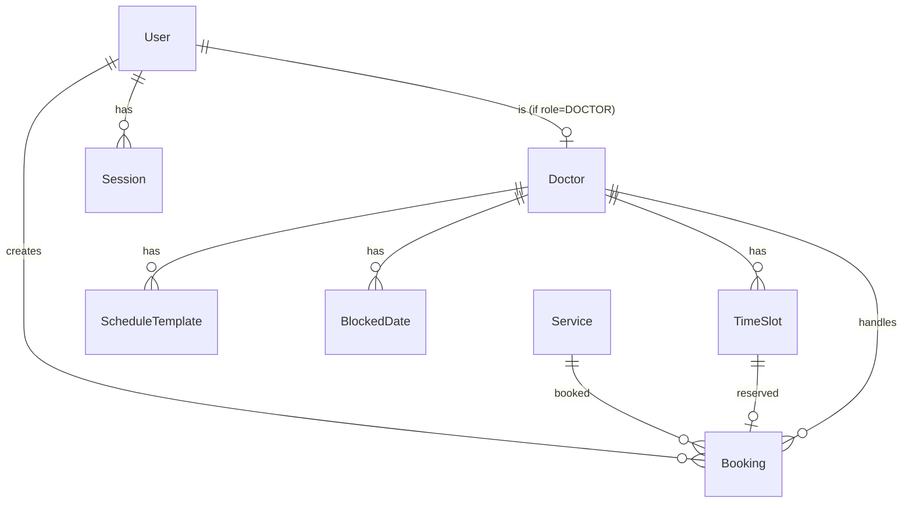

# Klinik Gigi Senyum Sejahtera - Architecture & Database

> **The Rules** — Struktur data dan aturan main sistem.

---

## Directory Structure

```
dental-care/
├── prisma/
│   ├── schema.prisma          # Database schema
│   └── seed.ts                # Seed data (dokter, layanan, admin)
├── src/
│   ├── app/
│   │   ├── (auth)/            # Auth pages (login, register)
│   │   │   ├── sign-in/
│   │   │   └── sign-up/
│   │   ├── (home)/            # Patient-facing pages
│   │   │   ├── page.tsx       # Landing page
│   │   │   ├── booking/
│   │   │   │   ├── pilih-layanan/
│   │   │   │   ├── pilih-dokter/
│   │   │   │   └── pilih-jadwal/
│   │   │   ├── checkout/
│   │   │   ├── booking-success/
│   │   │   ├── my-bookings/
│   │   │   ├── about/
│   │   │   └── support/
│   │   ├── dashboard/         # Admin dashboard
│   │   │   ├── page.tsx       # Admin home
│   │   │   ├── schedule/
│   │   │   ├── bookings/
│   │   │   ├── doctors/
│   │   │   ├── services/
│   │   │   ├── patients/
│   │   │   ├── reports/
│   │   │   └── settings/
│   │   ├── doctor/            # Doctor portal
│   │   │   ├── page.tsx       # Doctor home
│   │   │   ├── schedule/
│   │   │   └── patients/
│   │   ├── api/               # API routes
│   │   │   ├── services/
│   │   │   ├── doctors/
│   │   │   ├── slots/
│   │   │   ├── bookings/
│   │   │   ├── admin/
│   │   │   └── webhooks/
│   │   └── globals.css        # Global styles
│   ├── components/
│   │   ├── ui/                # Reusable UI components
│   │   ├── booking/           # Booking-specific components
│   │   ├── admin/             # Admin-specific components
│   │   └── doctor/            # Doctor portal components
│   ├── hooks/                 # Custom React hooks
│   ├── lib/                   # Utilities
│   │   ├── auth.ts            # Lucia auth config
│   │   ├── prisma.ts          # Prisma client
│   │   ├── midtrans.ts        # Midtrans helper
│   │   ├── fonnte.ts          # WhatsApp API helper
│   │   ├── utils.ts           # General utilities
│   │   └── validations.ts     # Zod schemas
│   └── types/                 # TypeScript definitions
└── documentation/             # Documentation (YOU ARE HERE)
```

---

## File Organization Rules

### Page-Specific Components

```
page-folder/
├── page.tsx              # Main page (Server Component)
├── loading.tsx           # Loading skeleton
├── error.tsx             # Error boundary
├── _components/          # Page-specific components
│   ├── ComponentA.tsx    # Client/Server components
│   └── ComponentB.tsx
├── lib/
│   ├── actions.ts        # Server actions
│   └── data.ts           # Data fetching functions
└── providers/            # Context providers (if needed)
    └── SomeProvider.tsx
```

### Shared Components

```
src/components/
├── ui/                   # Base UI components (Button, Input, etc.)
├── booking/              # Booking flow components
│   ├── ServiceCard.tsx
│   ├── DoctorCard.tsx
│   ├── TimeSlotGrid.tsx
│   └── BookingStepper.tsx
├── admin/                # Admin dashboard components
│   ├── StatCard.tsx
│   ├── ScheduleCalendar.tsx
│   └── BookingTable.tsx
└── doctor/               # Doctor portal components
    └── DoctorSchedule.tsx
```

---

## Database Schema

### Connection

```env
DATABASE_URL="postgresql://..."
DIRECT_URL="postgresql://..."
```

### Enums

```typescript
enum RoleUser {
  PATIENT = "PATIENT"   // Pasien biasa
  DOCTOR = "DOCTOR"     // Dokter (view only)
  ADMIN = "ADMIN"       // Administrator penuh
}

enum BookingStatus {
  PENDING = "PENDING"       // Menunggu pembayaran DP
  PAID = "PAID"             // DP sudah dibayar
  CHECKED_IN = "CHECKED_IN" // Pasien sudah datang
  COMPLETED = "COMPLETED"   // Perawatan selesai
  CANCELLED = "CANCELLED"   // Dibatalkan
  EXPIRED = "EXPIRED"       // Timeout pembayaran
}

enum DayOfWeek {
  MONDAY = "MONDAY"
  TUESDAY = "TUESDAY"
  WEDNESDAY = "WEDNESDAY"
  THURSDAY = "THURSDAY"
  FRIDAY = "FRIDAY"
  SATURDAY = "SATURDAY"
  SUNDAY = "SUNDAY"
}
```

### Tables

#### User

```prisma
model User {
  id        String   @id @default(cuid())
  name      String
  email     String   @unique
  password  String   // hashed with bcrypt
  phone     String?  // WhatsApp number
  role      RoleUser @default(PATIENT)
  createdAt DateTime @default(now())
  updatedAt DateTime @updatedAt

  // Relations
  bookings  Booking[]
  sessions  Session[]

  // For doctors only
  doctorProfile Doctor?

  @@index([email])
  @@index([role])
}
```

#### Session

```prisma
model Session {
  id        String   @id
  userId    String
  expiresAt DateTime

  user User @relation(fields: [userId], references: [id], onDelete: Cascade)

  @@index([userId])
}
```

#### Doctor

```prisma
model Doctor {
  id          String    @id @default(cuid())
  userId      String?   @unique  // Link to User account (optional)
  user        User?     @relation(fields: [userId], references: [id])
  name        String               // e.g., "drg. Handoko"
  speciality  String               // e.g., "Dokter Gigi Umum"
  bio         String?              // Short description
  image       String               // Photo URL
  phone       String?              // Contact number
  isActive    Boolean  @default(true)
  createdAt   DateTime @default(now())
  updatedAt   DateTime @updatedAt

  // Relations
  scheduleTemplates ScheduleTemplate[]
  timeSlots         TimeSlot[]
  bookings          Booking[]
  blockedDates      BlockedDate[]

  @@index([isActive])
}
```

#### Service (Layanan)

```prisma
model Service {
  id          String   @id @default(cuid())
  name        String               // e.g., "Scaling & Polishing"
  slug        String   @unique     // e.g., "scaling-polishing"
  description String?              // Detailed description
  price       Int                  // Full price in IDR
  dpAmount    Int                  // Down payment amount in IDR
  duration    Int      @default(60) // Duration in minutes
  image       String?              // Service image
  isActive    Boolean  @default(true)
  order       Int      @default(0)  // Display order
  createdAt   DateTime @default(now())
  updatedAt   DateTime @updatedAt

  // Relations
  bookings Booking[]

  @@index([isActive, order])
}
```

#### ScheduleTemplate (Weekly Template)

```prisma
model ScheduleTemplate {
  id         String    @id @default(cuid())
  doctorId   String
  doctor     Doctor    @relation(fields: [doctorId], references: [id], onDelete: Cascade)
  dayOfWeek  DayOfWeek
  startTime  String    // "09:00"
  endTime    String    // "17:00"
  slotDuration Int     @default(60) // minutes per slot
  isActive   Boolean   @default(true)
  createdAt  DateTime  @default(now())
  updatedAt  DateTime  @updatedAt

  @@unique([doctorId, dayOfWeek])
  @@index([doctorId])
}
```

#### BlockedDate (Dokter Cuti/Libur)

```prisma
model BlockedDate {
  id        String   @id @default(cuid())
  doctorId  String
  doctor    Doctor   @relation(fields: [doctorId], references: [id], onDelete: Cascade)
  date      DateTime @db.Date
  reason    String?  // e.g., "Cuti", "Training"
  createdAt DateTime @default(now())

  @@unique([doctorId, date])
  @@index([doctorId, date])
}
```

#### TimeSlot

```prisma
model TimeSlot {
  id          String   @id @default(cuid())
  doctorId    String
  doctor      Doctor   @relation(fields: [doctorId], references: [id])
  date        DateTime @db.Date
  startTime   String   // "09:00"
  endTime     String   // "10:00"
  isAvailable Boolean  @default(true)
  createdAt   DateTime @default(now())

  // Relations
  booking Booking?

  @@unique([doctorId, date, startTime])
  @@index([doctorId, date, isAvailable])
  @@index([date, isAvailable])
}
```

#### Booking

```prisma
model Booking {
  id              String        @id @default(cuid())
  code            String        @unique  // e.g., "DENT-ABC123"

  // Patient info
  patientId       String
  patient         User          @relation(fields: [patientId], references: [id])
  patientName     String        // Denormalized for quick access
  patientPhone    String        // WhatsApp number for notifications

  // Appointment info
  doctorId        String
  doctor          Doctor        @relation(fields: [doctorId], references: [id])
  serviceId       String
  service         Service       @relation(fields: [serviceId], references: [id])
  slotId          String        @unique
  slot            TimeSlot      @relation(fields: [slotId], references: [id])
  appointmentDate DateTime      @db.Date
  appointmentTime String        // "09:00"

  // Payment info
  dpAmount        Int           // DP yang harus dibayar
  dpPaid          Int           @default(0) // DP yang sudah dibayar
  totalPrice      Int           // Harga penuh layanan

  // Status & timestamps
  status          BookingStatus @default(PENDING)
  notes           String?       // Keluhan pasien
  tokenMidtrans   String?
  paidAt          DateTime?
  checkedInAt     DateTime?
  completedAt     DateTime?
  cancelledAt     DateTime?
  expiresAt       DateTime      // Payment timeout (15 min from creation)
  createdAt       DateTime      @default(now())
  updatedAt       DateTime      @updatedAt

  // Notifications tracking
  confirmationSent Boolean      @default(false)
  reminderSent     Boolean      @default(false)

  @@index([patientId])
  @@index([doctorId, appointmentDate])
  @@index([status])
  @@index([appointmentDate])
  @@index([expiresAt, status])
}
```

#### ClinicSettings

```prisma
model ClinicSettings {
  id              String   @id @default("default")
  clinicName      String   @default("Klinik Gigi Senyum Sejahtera")
  address         String?
  phone           String?
  email           String?
  whatsappNumber  String?  // For Fonnte
  operationalHours String? // JSON string
  paymentTimeout  Int      @default(15) // minutes
  reminderHours   Int      @default(24) // hours before appointment
  updatedAt       DateTime @updatedAt
}
```

### Entity Relationship Diagram



```
User 1──────N Session
  │
  └──1──────N Booking
              │
              ├──N───1 Doctor ───1───N TimeSlot
              │         │
              │         └───1───N ScheduleTemplate
              │         └───1───N BlockedDate
              │
              └──N───1 Service
```

---

## State Management

### Server State (TanStack Query + Axios)

```typescript
// src/lib/axios.ts
import axios from "axios";

export const api = axios.create({
  baseURL: "/api",
  headers: {
    "Content-Type": "application/json",
  },
});

// src/hooks/useServices.ts
import { useQuery } from "@tanstack/react-query";
import { api } from "@/lib/axios";

export function useServices() {
  return useQuery({
    queryKey: ["services"],
    queryFn: async () => {
      const { data } = await api.get("/services");
      return data;
    },
  });
}

// src/hooks/useAvailableSlots.ts
export function useAvailableSlots(doctorId: string, date: string) {
  return useQuery({
    queryKey: ["slots", doctorId, date],
    queryFn: async () => {
      const { data } = await api.get("/slots", {
        params: { doctorId, date },
      });
      return data;
    },
    enabled: !!doctorId && !!date,
  });
}
```

**Use Cases:** Services list, Doctors list, Available slots, Booking history, Admin data

### Client State (Zustand)

```typescript
// src/stores/useBookingStore.ts
import { create } from "zustand";
import { persist } from "zustand/middleware";

interface BookingState {
  selectedService: Service | null;
  selectedDoctor: Doctor | null;
  selectedSlot: TimeSlot | null;
  patientInfo: PatientInfo | null;

  // Actions
  setService: (service: Service) => void;
  setDoctor: (doctor: Doctor) => void;
  setSlot: (slot: TimeSlot) => void;
  setPatientInfo: (info: PatientInfo) => void;
  reset: () => void;
}

export const useBookingStore = create<BookingState>()(
  persist(
    (set) => ({
      selectedService: null,
      selectedDoctor: null,
      selectedSlot: null,
      patientInfo: null,

      setService: (service) => set({ selectedService: service }),
      setDoctor: (doctor) => set({ selectedDoctor: doctor }),
      setSlot: (slot) => set({ selectedSlot: slot }),
      setPatientInfo: (info) => set({ patientInfo: info }),
      reset: () =>
        set({
          selectedService: null,
          selectedDoctor: null,
          selectedSlot: null,
          patientInfo: null,
        }),
    }),
    { name: "booking-storage" }
  )
);
```

**Use Cases:** Booking wizard state (persisted), UI state (modals, filters)

### Form Handling (React Hook Form + Zod)

```typescript
// src/lib/validations/booking.ts
import { z } from "zod";

export const patientInfoSchema = z.object({
  name: z.string().min(2, "Nama minimal 2 karakter"),
  phone: z
    .string()
    .regex(
      /^(\+62|62|0)8[1-9][0-9]{6,10}$/,
      "Format nomor WhatsApp tidak valid"
    ),
  notes: z.string().max(500).optional(),
});

export type PatientInfoInput = z.infer<typeof patientInfoSchema>;

// Usage in component
import { useForm } from "react-hook-form";
import { zodResolver } from "@hookform/resolvers/zod";

export function CheckoutForm() {
  const form = useForm<PatientInfoInput>({
    resolver: zodResolver(patientInfoSchema),
    defaultValues: {
      name: "",
      phone: "",
      notes: "",
    },
  });

  const onSubmit = (data: PatientInfoInput) => {
    // Process checkout
  };

  return (
    <form onSubmit={form.handleSubmit(onSubmit)}>{/* Form fields */}</form>
  );
}
```

### Custom Hooks Directory

```
src/hooks/
├── useServices.ts        # Fetch all services
├── useDoctors.ts         # Fetch all doctors
├── useAvailableSlots.ts  # Fetch slots by doctor & date
├── useMyBookings.ts      # Fetch user's bookings
├── useCreateBooking.ts   # Mutation for creating booking
├── useCancelBooking.ts   # Mutation for canceling booking
├── useDebounce.ts        # Debounce utility
└── useCountdown.ts       # Payment timer countdown
```

### URL State (Search Params)

Used for admin dashboard filters and pagination:

```
/dashboard/bookings?status=PAID&doctor=xxx&page=2&limit=10
```

---

## Authentication Architecture

Using **Auth.js v5 (NextAuth)** with Prisma adapter and Google OAuth:

```typescript
// src/lib/auth.ts
import NextAuth from "next-auth";
import Google from "next-auth/providers/google";
import { PrismaAdapter } from "@auth/prisma-adapter";
import { prisma } from "./prisma";

export const { handlers, signIn, signOut, auth } = NextAuth({
  adapter: PrismaAdapter(prisma),
  providers: [
    Google({
      clientId: process.env.GOOGLE_CLIENT_ID!,
      clientSecret: process.env.GOOGLE_CLIENT_SECRET!,
    }),
  ],
  callbacks: {
    async session({ session, user }) {
      session.user.id = user.id;
      session.user.role = user.role;
      session.user.phone = user.phone;
      return session;
    },
  },
  pages: {
    signIn: "/sign-in",
    newUser: "/complete-profile",
  },
});
```

### Auth API Routes

```typescript
// src/app/api/auth/[...nextauth]/route.ts
import { handlers } from "@/lib/auth";
export const { GET, POST } = handlers;
```

### Auth Patterns

1. **Server Components** → Use `auth()` from `lib/auth.ts`
2. **API Routes** → Use `auth()` to get session
3. **Client Components** → Use `useSession()` hook from `next-auth/react`
4. **Route Handlers** → Use `handlers` for `/api/auth/*`

### Role-Based Middleware

```typescript
// src/middleware.ts
import { auth } from "@/lib/auth";

export default auth((req) => {
  const { nextUrl, auth } = req;
  const isLoggedIn = !!auth?.user;
  const role = auth?.user?.role;

  // Protect admin routes
  if (nextUrl.pathname.startsWith("/dashboard")) {
    if (!isLoggedIn || role !== "ADMIN") {
      return Response.redirect(new URL("/sign-in", nextUrl));
    }
  }

  // Protect doctor routes
  if (nextUrl.pathname.startsWith("/doctor")) {
    if (!isLoggedIn || role !== "DOCTOR") {
      return Response.redirect(new URL("/sign-in", nextUrl));
    }
  }

  // Protect patient routes
  if (
    nextUrl.pathname.startsWith("/my-bookings") ||
    nextUrl.pathname.startsWith("/checkout")
  ) {
    if (!isLoggedIn) {
      return Response.redirect(new URL("/sign-in", nextUrl));
    }
  }
});

export const config = {
  matcher: [
    "/dashboard/:path*",
    "/doctor/:path*",
    "/my-bookings/:path*",
    "/checkout/:path*",
  ],
};
```

### Extended User Type

```typescript
// src/types/next-auth.d.ts
import { DefaultSession } from "next-auth";

declare module "next-auth" {
  interface Session {
    user: {
      id: string;
      role: "PATIENT" | "DOCTOR" | "ADMIN";
      phone?: string;
    } & DefaultSession["user"];
  }

  interface User {
    role: "PATIENT" | "DOCTOR" | "ADMIN";
    phone?: string;
  }
}
```

---

## Schedule Generation Logic

### Weekly Template to Slots

```typescript
// lib/schedule.ts

interface GenerateSlotsParams {
  doctorId: string;
  startDate: Date; // Usually today
  endDate: Date; // Usually 4 weeks from now
}

async function generateSlots({
  doctorId,
  startDate,
  endDate,
}: GenerateSlotsParams) {
  // 1. Get doctor's schedule template
  const templates = await prisma.scheduleTemplate.findMany({
    where: { doctorId, isActive: true },
  });

  // 2. Get blocked dates
  const blockedDates = await prisma.blockedDate.findMany({
    where: {
      doctorId,
      date: { gte: startDate, lte: endDate },
    },
  });

  // 3. For each day in range
  for (let date = startDate; date <= endDate; date.addDays(1)) {
    const dayOfWeek = getDayOfWeek(date);
    const template = templates.find((t) => t.dayOfWeek === dayOfWeek);

    // Skip if no template or blocked
    if (!template) continue;
    if (blockedDates.some((b) => isSameDay(b.date, date))) continue;

    // 4. Generate slots based on template
    const slots = generateSlotsFromTemplate(template, date);

    // 5. Upsert slots (avoid duplicates)
    await prisma.timeSlot.createMany({
      data: slots,
      skipDuplicates: true,
    });
  }
}

function generateSlotsFromTemplate(
  template: ScheduleTemplate,
  date: Date
): TimeSlot[] {
  const slots = [];
  let currentTime = parseTime(template.startTime);
  const endTime = parseTime(template.endTime);

  while (currentTime < endTime) {
    const slotEnd = addMinutes(currentTime, template.slotDuration);
    if (slotEnd <= endTime) {
      slots.push({
        doctorId: template.doctorId,
        date,
        startTime: formatTime(currentTime),
        endTime: formatTime(slotEnd),
        isAvailable: true,
      });
    }
    currentTime = slotEnd;
  }

  return slots;
}
```

### Cron Jobs

```typescript
// Scheduled tasks (using Vercel Cron or similar)

// 1. Generate slots for next week (run daily at midnight)
// GET /api/cron/generate-slots

// 2. Expire unpaid bookings (run every minute)
// GET /api/cron/expire-bookings

// 3. Send H-1 reminders (run daily at 10:00)
// GET /api/cron/send-reminders
```

---

## Supabase Storage

### Configuration

```env
NEXT_PUBLIC_SUPABASE_URL=https://xxx.supabase.co
NEXT_PUBLIC_SUPABASE_ANON_KEY=xxx
SUPABASE_SERVICE_ROLE_KEY=xxx
```

### Supabase Client

```typescript
// src/lib/supabase.ts
import { createClient } from "@supabase/supabase-js";

export const supabase = createClient(
  process.env.NEXT_PUBLIC_SUPABASE_URL!,
  process.env.NEXT_PUBLIC_SUPABASE_ANON_KEY!
);

// For server-side with service role
export const supabaseAdmin = createClient(
  process.env.NEXT_PUBLIC_SUPABASE_URL!,
  process.env.SUPABASE_SERVICE_ROLE_KEY!
);
```

### Upload Helper

```typescript
// src/lib/upload.ts
import { supabase } from "./supabase";

interface UploadResult {
  url: string;
  path: string;
}

export async function uploadImage(
  file: File,
  bucket: "doctors" | "services",
  folder?: string
): Promise<UploadResult> {
  const fileExt = file.name.split(".").pop();
  const fileName = `${Date.now()}-${Math.random()
    .toString(36)
    .substring(7)}.${fileExt}`;
  const filePath = folder ? `${folder}/${fileName}` : fileName;

  const { error } = await supabase.storage.from(bucket).upload(filePath, file, {
    cacheControl: "3600",
    upsert: false,
  });

  if (error) throw error;

  const {
    data: { publicUrl },
  } = supabase.storage.from(bucket).getPublicUrl(filePath);

  return {
    url: publicUrl,
    path: filePath,
  };
}

export async function deleteImage(bucket: string, path: string) {
  const { error } = await supabase.storage.from(bucket).remove([path]);
  if (error) throw error;
}
```

### Storage Buckets

| Bucket     | Purpose               | Access |
| ---------- | --------------------- | ------ |
| `doctors`  | Doctor profile photos | Public |
| `services` | Service images        | Public |

### Usage in Forms

```typescript
// In admin doctor form
import { uploadImage } from "@/lib/upload";

const onSubmit = async (data: DoctorFormData) => {
  let imageUrl = data.existingImage;

  if (data.imageFile) {
    const result = await uploadImage(data.imageFile, "doctors");
    imageUrl = result.url;
  }

  await createDoctor({ ...data, image: imageUrl });
};
```

---

## Midtrans Integration

### Configuration

```env
MIDTRANS_SERVER_KEY=xxx
MIDTRANS_CLIENT_KEY=xxx
NEXT_PUBLIC_MIDTRANS_CLIENT_KEY=xxx
MIDTRANS_IS_PRODUCTION=false
```

### Create Transaction

```typescript
// lib/midtrans.ts
import Midtrans from "midtrans-client";

const snap = new Midtrans.Snap({
  isProduction: process.env.MIDTRANS_IS_PRODUCTION === "true",
  serverKey: process.env.MIDTRANS_SERVER_KEY,
  clientKey: process.env.MIDTRANS_CLIENT_KEY,
});

export async function createPaymentToken(booking: Booking) {
  const parameter = {
    transaction_details: {
      order_id: booking.code,
      gross_amount: booking.dpAmount,
    },
    customer_details: {
      first_name: booking.patientName,
      phone: booking.patientPhone,
    },
    item_details: [
      {
        id: booking.serviceId,
        name: `DP - ${booking.service.name}`,
        price: booking.dpAmount,
        quantity: 1,
      },
    ],
    expiry: {
      unit: "minute",
      duration: 15,
    },
  };

  const transaction = await snap.createTransaction(parameter);
  return transaction.token;
}
```

### Webhook Handler

```typescript
// app/api/webhooks/midtrans/route.ts
export async function POST(req: Request) {
  const body = await req.json();
  const { order_id, transaction_status, fraud_status } = body;

  // Verify signature
  // ...

  if (transaction_status === "settlement" || transaction_status === "capture") {
    // Update booking status to PAID
    await prisma.booking.update({
      where: { code: order_id },
      data: {
        status: "PAID",
        dpPaid: Number(body.gross_amount),
        paidAt: new Date(),
      },
    });

    // Send WhatsApp confirmation
    await sendBookingConfirmation(order_id);
  }

  return Response.json({ status: "ok" });
}
```

---

## Fonnte WhatsApp Integration

### Configuration

```env
FONNTE_API_KEY=xxx
FONNTE_DEVICE_ID=xxx
```

### Send Message

```typescript
// lib/fonnte.ts
const FONNTE_API_URL = "https://api.fonnte.com/send";

interface SendMessageParams {
  phone: string;
  message: string;
}

export async function sendWhatsApp({ phone, message }: SendMessageParams) {
  const response = await fetch(FONNTE_API_URL, {
    method: "POST",
    headers: {
      Authorization: process.env.FONNTE_API_KEY!,
      "Content-Type": "application/json",
    },
    body: JSON.stringify({
      target: phone,
      message,
      countryCode: "62", // Indonesia
    }),
  });

  return response.json();
}
```

### Message Templates

```typescript
// lib/message-templates.ts

export function getBookingConfirmationMessage(booking: BookingWithRelations) {
  return `✅ *Booking Berhasil!*

Halo ${booking.patientName},
Terima kasih telah melakukan reservasi di *Klinik Gigi Senyum Sejahtera*.

📋 *Detail Booking:*
🔢 Kode: ${booking.code}
🦷 Layanan: ${booking.service.name}
👨‍⚕️ Dokter: ${booking.doctor.name}
📅 Tanggal: ${formatDate(booking.appointmentDate)}
⏰ Jam: ${booking.appointmentTime}

📍 *Lokasi:* ${CLINIC_ADDRESS}

Harap datang 15 menit sebelum jadwal.
Sampai jumpa! 😊`;
}

export function getReminderMessage(booking: BookingWithRelations) {
  return `⏰ *Pengingat Appointment*

Halo ${booking.patientName},
Ini pengingat untuk jadwal kunjungan Anda besok:

🦷 ${booking.service.name}
👨‍⚕️ ${booking.doctor.name}
📅 ${formatDate(booking.appointmentDate)}
⏰ ${booking.appointmentTime}

Jangan lupa bawa foto KTP/identitas.
Jika ingin reschedule, hubungi kami segera.

Salam sehat! 🦷`;
}
```

---

## Admin URL State Management

### Pattern: Search Params for Filters

```tsx
// Reading params in Server Component
export default async function BookingsPage({
  searchParams,
}: {
  searchParams: {
    status?: string;
    doctor?: string;
    date?: string;
    q?: string;
    page?: string;
  };
}) {
  const filters = {
    status: searchParams.status || "all",
    doctorId: searchParams.doctor,
    date: searchParams.date,
    search: searchParams.q || "",
    page: parseInt(searchParams.page || "1"),
  };

  const data = await getBookings(filters);

  return <BookingsTable data={data} />;
}
```

### Pattern: Client Component for URL Updates

```tsx
"use client";

import { useRouter, useSearchParams, usePathname } from "next/navigation";
import { useCallback } from "react";

export function useAdminFilters() {
  const router = useRouter();
  const pathname = usePathname();
  const searchParams = useSearchParams();

  const setFilter = useCallback(
    (name: string, value: string) => {
      const params = new URLSearchParams(searchParams.toString());
      if (value && value !== "all") {
        params.set(name, value);
      } else {
        params.delete(name);
      }
      // Reset page when filter changes
      if (name !== "page") {
        params.set("page", "1");
      }
      router.push(`${pathname}?${params.toString()}`);
    },
    [router, pathname, searchParams]
  );

  return { setFilter, searchParams };
}
```

---

## Security Considerations

### Input Validation

All inputs are validated using Zod schemas:

```typescript
// lib/validations.ts
import { z } from "zod";

export const CreateBookingSchema = z.object({
  serviceId: z.string().cuid(),
  doctorId: z.string().cuid(),
  slotId: z.string().cuid(),
  patientName: z.string().min(2).max(100),
  patientPhone: z.string().regex(/^(\+62|62|0)8[1-9][0-9]{6,10}$/),
  notes: z.string().max(500).optional(),
});
```

### API Security

- All API routes verify session/role
- Rate limiting on booking creation
- CSRF protection via SameSite cookies
- Midtrans webhook signature verification

### Data Protection

- Passwords hashed with bcrypt (12 rounds)
- Sensitive data (tokens) not exposed to client
- Patient phone numbers only visible to admin/doctor
